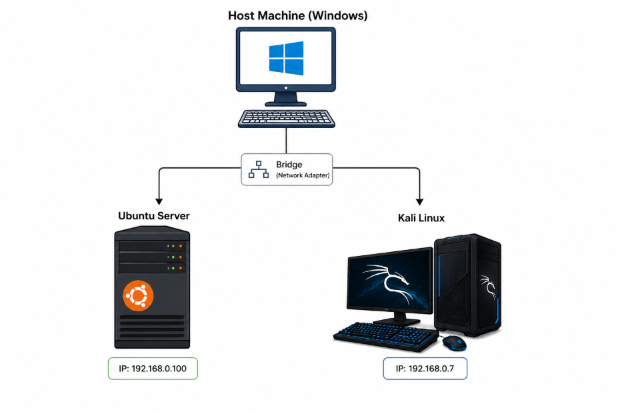

# Lab Architecture

## Overview

The lab runs entirely inside VirtualBox on a Windows 11 host laptop (16GB RAM). Two VMs make up the environment:

- **Kali Linux** — attacker machine
- **Ubuntu Server 24.04** — hosts the full Wazuh stack (manager, indexer, dashboard) and Suricata IDS, and also serves as the attack target

## Hosts

| Host | Role | IP (static) | Key services |
|---|---|---|---|
| Kali Linux | Attacker | 192.168.0.7 | Nmap, Hydra |
| Ubuntu Server 24.04 | Wazuh manager + target | 192.168.0.100 | Wazuh manager/indexer/dashboard, Suricata, sshd |
| Windows 11 | Hypervisor host | 192.168.0.1 | VirtualBox, used for reconnaissance scope only |

## Why the manager is also the target

Unlike a typical SOC lab setup with a separate Wazuh agent installed on a victim machine, this exercise points the attack directly at the Wazuh manager itself. In every alert generated, `agent.id` shows `000` — Wazuh's reserved ID for the manager monitoring itself, ingesting its own local `/var/log/auth.log` (via a `localfile` block in `ossec.conf`) rather than receiving forwarded events from a remote agent.

This is a valid and common way to start a home lab (fewer moving parts to configure — no agent registration/enrollment step), but a good next-stage improvement would be adding a **separate agent-monitored machine** as the target so alerts arrive over the manager–agent channel (port 1514) instead of local self-monitoring. That's noted as a possible next step rather than a limitation of this exercise.

## Detection stack on the manager

Two detection sources feed into Wazuh here:

1. **Host-based (Wazuh's own log analysis)** — reads `/var/log/auth.log` for SSH/PAM events (login failures, successes, session opens/closes)
2. **Network-based (Suricata)** — a network IDS running on the same host, writing alerts to `/var/log/suricata/eve.json`, which Wazuh ingests via a `localfile` block with `log_format: json`

This combination is deliberate: host-based detection catches what happens *on* the machine (failed logins, successful logins), while network-based detection catches what happens *to* the machine over the wire (port scans, suspicious traffic patterns) — even for scans that never generate an application-level log entry.

See [Wazuh Server Setup](2.wazuh-server-setup.md) and [Suricata IDS Integration](6.suricata-ids-integration.md) for configuration details.
