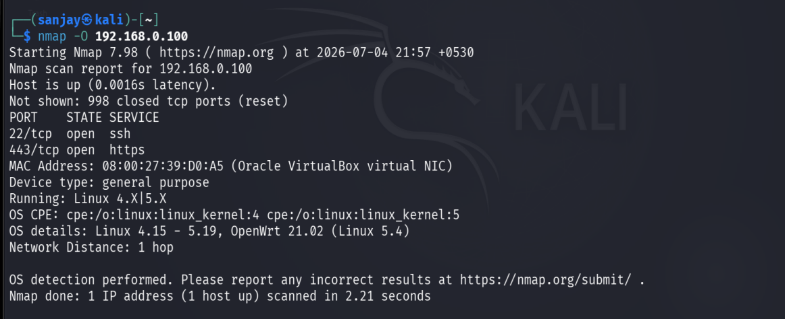

# Network Reconnaissance

## Objective

Before attempting any exploitation, the network was scanned from Kali to identify live hosts and open services — the same first step an attacker (or a penetration tester) takes, and the same activity a SOC analyst should expect to see as an early-warning signal in alert data.

## Scope

Scans were run against the local subnet `192.168.0.0/24`, including:
- `192.168.0.100` — Ubuntu Server (Wazuh manager / target)
- `192.168.0.1` — Windows 11 host

## Workflow

A standard reconnaissance workflow was used, scanning progressively from broad discovery to specific service fingerprinting:

```bash
# 1. Host discovery — find live hosts on the subnet
nmap -sn 192.168.0.0/24

# 2. Full port scan of the target — find all open TCP ports
nmap -p- 192.168.0.100

# 3. Service/version detection on discovered open ports
nmap -sV -sC 192.168.0.100

# 4. OS fingerprinting (confirmed via screenshot below)
nmap -O 192.168.0.100
```

> Only the OS-detection scan (`nmap -O`) has a saved terminal screenshot below; the discovery and port-scan steps were run but not captured, and are documented here as the workflow that was followed.

## Confirmed result



```
nmap -O 192.168.0.100
PORT     STATE SERVICE
22/tcp   open  ssh
443/tcp  open  https
```

**Key finding:** port 22 (SSH) is open and reachable — this is the entry point targeted in the next phase. See [SSH Brute Force Simulation](4.ssh-bruteforce-simulation.md).

## Detection note

Even though this phase produced no host-based Wazuh alert (Nmap scanning doesn't touch `auth.log`), it did **not** go unnoticed — Suricata, monitoring at the network layer, flagged the scanning activity across multiple ports as it happened. See [Suricata IDS Integration](6.suricata-ids-integration.md) for the alerts this generated, including one for a probe to MSSQL port 1433 that was part of the same scanning sweep.

This is a useful thing to internalize for SOC work: host-based logging (Wazuh reading `auth.log`) and network-based detection (Suricata watching the wire) catch *different* things, and a full picture of an attack usually needs both.
