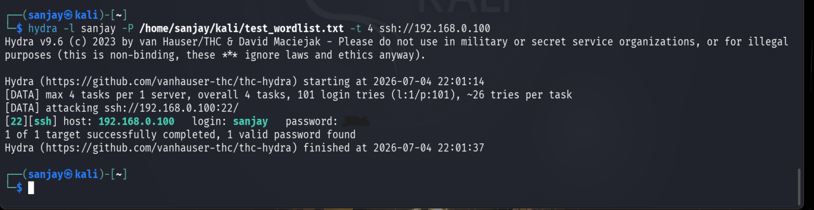

# SSH Brute Force Simulation

## Objective

With SSH confirmed open on the target (`192.168.0.100`, see [Network Reconnaissance](3.network-reconnaissance.md)), the next step was to simulate a real brute-force credential attack against it, so the resulting Wazuh detections could be captured and analyzed.

## Tool & Command

**Hydra v9.6** was used from Kali:

```bash
hydra -l sanjay -P /home/sanjay/kali/test_wordlist.txt -t 4 ssh://192.168.0.100
```

- `-l sanjay` — target username
- `-P /home/sanjay/kali/test_wordlist.txt` — password wordlist, a curated 101-entry subset extracted from a larger public password list
- `-t 4` — 4 parallel tasks
- `ssh://192.168.0.100` — target service and host

## Result



```
[DATA] max 4 tasks per 1 server, overall 4 tasks, 101 login tries (l:1/p:101), ~26 tries per task
[DATA] attacking ssh://192.168.0.100:22/
[22][ssh] host: 192.168.0.100   login: sanjay   password: [REDACTED]
1 of 1 target successfully completed, 1 valid password found
```

Runtime: ~23 seconds (22:01:14 → 22:01:37).

## Lab conditions note

The real SSH account password was deliberately inserted into the 101-entry wordlist for this test, so that the attack would succeed and produce a "brute force followed by successful login" detection event in Wazuh — this was testing **detection capability**, not demonstrating an unknown-credential compromise. In a real engagement this distinction matters: a successful Hydra run here confirms Wazuh can catch this attack pattern, not that the target's password was inherently weak or guessable.

## What this produced downstream

This single attack run generated multiple distinct Wazuh alerts — repeated authentication failures, individual `sshd` failure events, and a high-severity correlation alert for "failures followed by success." Full breakdown in [Detection & Analysis](5.detection-analysis.md).
