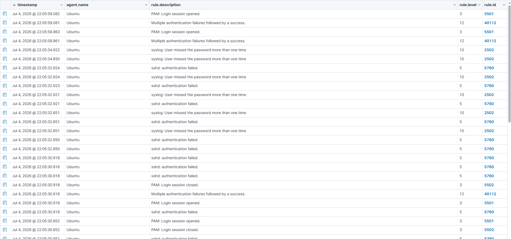

# Detection & Analysis

This is the core analyst write-up: what Wazuh detected during the Hydra attack, what each alert means, and how an L1 analyst should reason through it.

## Alert timeline



| Time | Rule ID | Level | Description |
|---|---|---|---|
| 22:05:30.852 | 5501 | 3 | PAM: Login session opened |
| 22:05:30.918 | 5760 | 5 | sshd: authentication failed |
| 22:05:30.918 | 2502 | 10 | syslog: User missed the password more than one time |
| 22:05:30.918 | 40112 | 12 | Multiple authentication failures followed by a success |
| 22:05:30.918 | 5502 | 3 | PAM: Login session closed |
| ... | 5760 / 2502 | 5 / 10 | (repeated failure pairs, several more rounds) |
| 22:05:58.861–.863 | 40112 / 5501 | 12 / 3 | Second success-after-failures + session opened |
| 22:05:59.081 | 40112 | 12 | Multiple authentication failures followed by a success (final) |

Two full raw alerts are saved for reference:
- [`evidence/alerts/alert-repeated-auth-failure.json`](../evidence/alerts/alert-repeated-auth-failure.json) — rule 2502
- [`evidence/alerts/alert-auth-success-after-failures.json`](../evidence/alerts/alert-auth-success-after-failures.json) — rule 40112

## What each rule means

**Rule 5760 — `sshd: authentication failed`** (level 5)
The most granular signal: fires once per individual failed login attempt. Low severity on its own — a single failed login happens all the time from typos — but the *rate* of these firing back-to-back is the first sign something automated is happening.

**Rule 2502 — `syslog: User missed the password more than one time`** (level 10)
This is PAM noticing repeated failures for the *same session* before a hard cutoff, per the `full_log`:
```
PAM 3 more authentication failures; ... rhost=192.168.0.7  user=sanjay
```
Level jumps to 10 here specifically because it's no longer "a failed login," it's "repeated failed logins in a short window" — already a meaningful escalation signal, mapped to MITRE **T1110 (Brute Force)**.

**Rule 40112 — `Multiple authentication failures followed by a success`** (level 12, the highest in this set)
This is a Wazuh **correlation rule** — it doesn't just look at one log line, it watches for a specific *pattern across time*: several 5760/2502-style failures, immediately followed by a successful login from the same source. That pattern is exactly what a successful brute-force attack looks like, which is why it's mapped to both:
- **T1110 (Brute Force)** — the technique used to get in
- **T1078 (Valid Accounts)** — because the attacker now holds a legitimate credential, which is far more dangerous than the brute-force attempt itself, since it can blend into normal activity afterward

**Rules 5501 / 5502 — `PAM: Login session opened / closed`** (level 3)
Informational on their own — but in this timeline, seeing 5501 fire immediately after a 40112 is what confirms the attacker's session was actually established, not just attempted.

## MITRE ATT&CK mapping

| Rule | Technique | Tactic |
|---|---|---|
| 2502 | T1110 – Brute Force | Credential Access |
| 40112 | T1110 – Brute Force, T1078 – Valid Accounts | Credential Access, Initial Access, Persistence, Privilege Escalation, Defense Evasion |

## How an L1 analyst should triage this

1. **Immediate escalation trigger:** rule 40112 firing is the one that matters most — it's not "someone might be trying," it's "someone succeeded after failing." This should be escalated immediately, not queued.
2. **Supporting context:** pull the 2502/5760 events in the preceding window to build the attack timeline — this is what turns "an alert fired" into "here's what actually happened," which is what an incident write-up needs.
3. **Response actions to consider:** block/rate-limit the source IP (`192.168.0.7` here), force a password reset for the affected account, and check for any *other* successful logins from that source IP across the environment (lateral movement check).
4. **Shift handoff note:** even the lower-level 2502 alerts are worth flagging in a handoff if there's a *pattern* of repeated attempts against the same account over time, even without an eventual success — that's reconnaissance/probing worth watching.

## Observed anomaly: timestamp gap

The Hydra attack ran from **22:01:14 to 22:01:37** (from the terminal screenshot), but the corresponding Wazuh alerts are timestamped **22:05:30–22:05:59** — roughly a 4-minute gap. This is worth calling out rather than glossing over: it's most likely clock drift between the Kali VM and the Ubuntu manager (VirtualBox VMs can drift out of sync with the host, especially without NTP configured on both).

**Takeaway:** for reliable timeline correlation in future exercises (and in any real investigation spanning multiple hosts), synchronized clocks via NTP on every host are a prerequisite — a few minutes of drift is exactly the kind of thing that can misattribute an event to the wrong stage of an attack chain.
